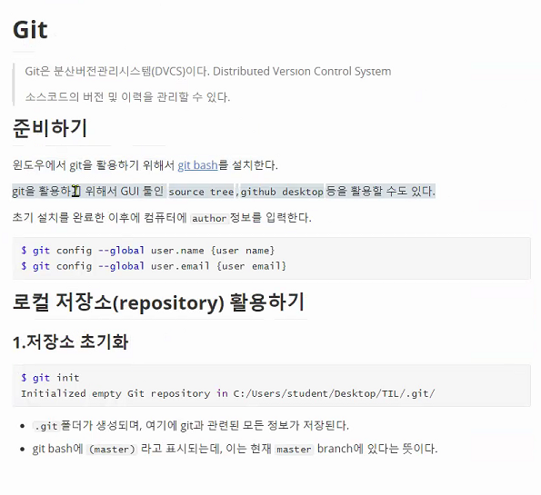

#### 2. add

`working directory (작업공간)` 에서 변경된 사항을 이력으로 저장하기 위해 반드시 `staging area`에 올려야 한다. 

```bash
$ git add git_wjdfl.md   # 특정 파일
$ git add python/        # 특정 폴더
$ git add .              # 현재 디렉토리의 모든 파일
```

#### 3. Commit

* 버전의 이력을 확정짓는 명령어, 해당 시점을 스냅샷으로 만들어서 기록을 한다.

* 커밋시에는 반드시 log 메세지를 작성해야하며, log 메세지는 변경사항을 알 수 있도록 명확하게 작성해주면 된다.

```bash
$ git commit -m '깃 정리 문서 작성'
```


#### 4. 원격 저장소 (GitHub / GitLab)

##### 0. repository 생성

##### 1. 원격 저장소를 local에 등록

```bash
$ git remote add origin '깃 레퍼지토리 주소' # 원격저장소를 관리하는 remote에 origin 추가
$ git remote -v  #현재 등록된 remote 정보를 확인 가능.
```


##### 2. Push

* 원격저장소로 업로드

```bash
$ git push origin master
```

-------


### 우리의 루틴

* 집에서 한 것이 최신 버전이고 싸피에서 깃 작업을 한번도 하지 않은 경우

  1. `'git clone 원격저장소 주소(레퍼지토리 주소)'` // 레퍼지토리 목록에서 code - 주소복사
     * 원격 저장소를 기준으로 최신 버전의 파일이 다운로드 받아짐
     * .git 폴더도 자동 생성되어 짐. (git DB가 들어 있기 때문)

  * add - commit - push 루틴은 같다.

  

* 싸피에서 한 것이 최신 버전이고 집에서 작업을 하는 경우 

  `pull - add - commit - push`

   `git pull 하는 법: git pull 입력`or `git pull origin master 입력`

  해당 루틴으로 진행하면 끝!

  

* 집에서 한 것이 최신 버전이고 집에서 작업을 하는 경우

  `add - commit - push` 

  