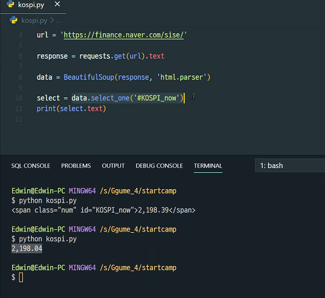
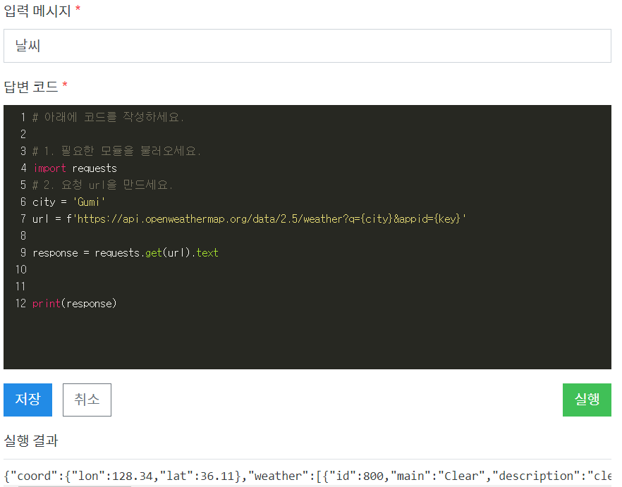
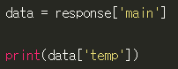

리눅스 서버의 파일을 불러올 때는 ls 입력


파이썬 코드 실행법: $ python kospi.py


외장모듈 2가지의 종류

* 파이썬이 기본으로 제공하는 외장모듈 (책상 서랍에 위치)
  * import
  * 사용
* 다른 사람이 만들어둔 외장모듈 (문구점에 사러가야 함)
  * pip 툴을 이용해서 외장 모듈을 설치
  * import
  * 사용


#### 웹크롤링을 위한 외장모듈 

### 1. requests

* 간편한 http 요청처리기가 들어 있는 모듈

* 설치 하는 방법

  ``` python
  pip install requests
  ```


#### 2. BeautifulSoup

* 텍스트 값을 바로 사용할 수 없으므로 모양을 바꿔줘야함

* 텍스트로 나타나는 html을 우리가 사용하기 쉽게 바꿔주는 역할을 하는 모듈

* 설치가 필요

  ```python
  pip install beautifulsoup4
  ```

* select_one 으로 원하는 값을 가지고 있는 html을 선택하여 가져오는 명령

* print는 select된 것들 중에서 text만 뽑아서 표현

  


### 3. 파이썬 내장함수 json


* ### url과 response가 핵심이다



웹에서 f12 눌러서 해당 값  - copy selector - 붙여넣기

### select = data.select_one('') : data중 원하는 값 하나 가져오기

### select = data.select('') : data중 원하는 값 여러개 가져오기





받은 response 파일을 json 형태로 받으려면 파이썬 내장함수로 가능 - dictionary 함수로 됨


딕셔너리에서 key값인 main을 프린트 하는 코드


딕셔너리 안에 또 딕셔너리 key 값을 불러오려면 바깥부터 천천히 접근하면 됨.



weather에서 main 딕셔너리 키값을 불러오는 법


```python
날씨

# 1. 필요한 모듈을 불러오세요.
import requests
# 2. 요청 url을 만드세요.
city = 'Gumi'
url = f'https://api.openweathermap.org/data/2.5/weather?q={city}&appid={key}'

response = requests.get(url).json()

#기온에 대한 정보
data = response['main']

#날씨에 대한 정보

weather = response['weather'][0]['main']

#기온에 대한 정보

temp = data['temp'] - 273.15
max_temp = data['temp_max'] - 273.15
min_temp = data['temp_min'] - 273.15

print(f'현재 {city}의 날씨는 {weather}이며, 현재 기온은 {temp} (최저:{min_temp}) (최대:{max_temp})')
```


### 웹 크롤링 & API 통신이 큰 흐름

1. url로 요청을 한다.   // 외장모듈인 requests 이용

2. 받은 응답을 가지고 원하는 데이터를 가지고 온다. // beautifulsoup 과 파이썬 내장함수인 json을 활용

   json -> Dictionary 형태로 변환해서 사용