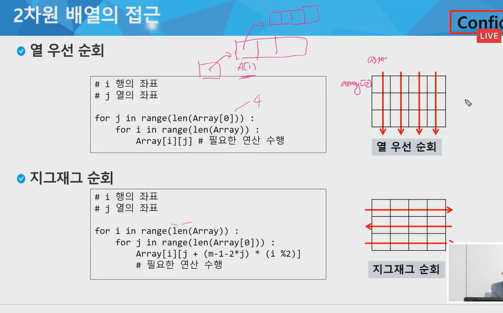
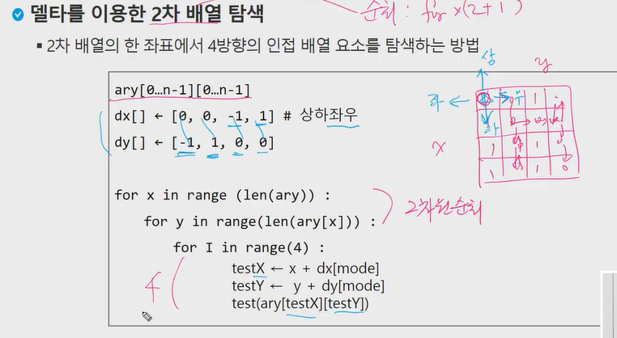
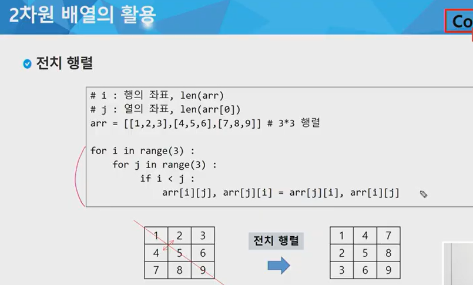
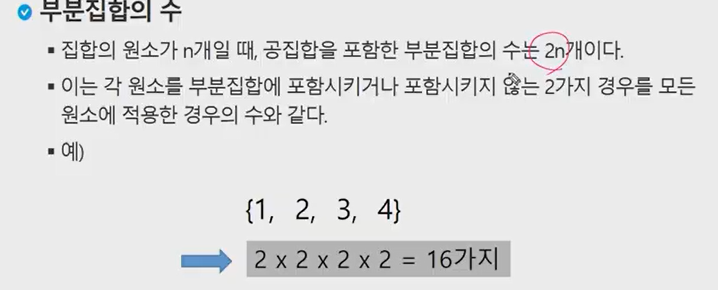
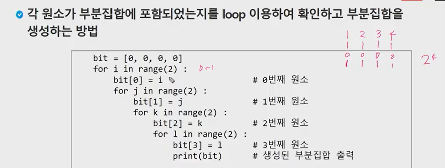
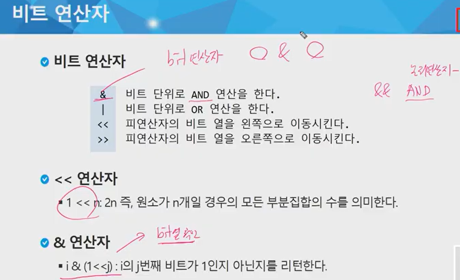

# 2차원 배열

arr = [[0, 1, 2, 3], [4, 5, 6, 7]]

| 0    | 1    | 2    | 3    |
| ---- | ---- | ---- | ---- |
| 4    | 5    | 6    | 7    |


```python
# 2차원배열 반복문 접근하기
# 2차원 배열 : 배열의 원소가 배열인 형태


arr = [[1, 2, 3], [4, 5, 6, 7], [7, 8], [9]]
#arr의 길이: 4
# 순회하면서 arr의 모든 원소의 합 구하기

sum_v = 0
for i in range(len(arr)):

    for j in range(len(arr[i])):
        sum_v += arr[i][j]
print(sum_v)
```





len(Array) : 세로 길이

len(Array[]): 가로 길이


```python
arr = [[1, 2, 3],
       [4, 5, 6],
       [7, 8, 9]
      ]

# 행우선
N = len(arr)        #행의 길이
M = len(arr[0])          # 열의 길이
for i in range(N):
    for j in range(M):
        print(arr[i][j], end =" ")
    print()
print()

# 열우선
for j in range(M):       # 열
    for i in range(N):      # 행
        print(arr[i][j], end=" ") 
	print()
print()
```


## delta 연산하기 매우 중요!!!!


### delta: 원하는 순서대로 2차원 배열을 순회하기 위해서 사용

#### 상하좌우 순서로 접근할 수 있는 델타

```python
dy = [-1, 1, 0, 0]
dx = [0, 0, -1, 1]

[0,0][0,1][0,2]
[1,0][1,1][1,2]
[2,0][2,1][2,2]

arr = [[1, 2, 3], [4, 5, 6], [7 ,8 ,9]]
r = 1
c = 1
print(arr[r][c])
r += dy[0]
c += dx[0]


# 대각선 가는법 -> x,y 모두 1씩 증가
r = 1
c = 1

r += dy[2]
c += dx[4]

#상하 좌우 연속으로 순회하기
for i in range(4):      # 원하는 방향이 4방향이므로
	# 다음 좌표를 계산
    nr = r + dr[i]         # next row = row + row의 변화량
    nc = c + dc[i]
    sum_v += arr[nr][nc]
    
    print(sum_v)
    print(arr[nr][nc])
    
    
# 8방으로 순회하기
x = 1
y = 1

len = [[1, 2, 3], [4, 5, 6], [7 ,8 ,9]]

dy = [0, 1, 1, 1, 0, -1, -1, -1]      
dx = [-1, -1, 0, 1, 1, 1, 0, -1]
 
 01    02    12    22   21   20    10      00		 

 -1 0  -1 1  0 1	1,1  1,0  1 -1  0 -1	-1-1
for x in range(len(arr)):
    for y in range(len(arr[x])): 
		for i in range(8):
    
    		nx = x + dx[i]
    		ny = y + dy[i]
            new = arr[nx][ny]
			print(new)
```





* 인덱스 체크 , 방문체크 해야함


```python
arr = [[1, 2, 3, 4],
       [5, 6, 7, 8],
       [9, 10, 11, 12]
      ]


N = len(arr)

M = len(arr[0])


dx = [0, 0, -1, 1]

dy = [-1, 1, 0, 0]


for x in range(N):
    for y in range(M):
        for i in range(4):
            testX = x + dx[i]
            testY = y + dy[i]
            if testX > 0 and testX < N and testY >= 0 and testY < M:  # 인덱스체크
            (if 0 <= testX < N and 0 <= testY < M:  # 이것도 가능)  
                print(arr[testX][testY], end=" ")
            
-> 5 6 7 8 6 9 5 7 10 6 8 11 7 12 10 5 9 11 6 10 12 7 11 8 
            
```





```python
​```
3 3
1 2 3
4 5 6
7 8 9


# 첫번째 방법

N, M = map(int, input().split())
mylist = [0 for _ in range(N)]
# mylist = [0] * N

for i in range(N):
    mylist[i] = list(map(int, input().split()))
print(mylist)

# 두번째 방법

N, M = map(int, input().split())
mylist = []

for i in range(N):
   	mylist.append(list(map(int, input().split())))
print(mylist)


# 세번째 방법

N, M = map(int, input().split())
mylist = [list(map(int,input().split())) for _ in range(N)]
print(mylist)

# 2차원 배열을 0으로 초기화 하는 방법
N = 3 	# 행
M = 4 	# 열

v = [[0 for _ in range(M)] for _ in range(N)]    # @@@@열을 먼저 만든다@@@@ 
(v = [[0]*M for _ in range(N)])

print(v)
```

```python
​```
N, M = map(int, input().split())
arr = [list(map(int,input().split())) for _ in range(N)]
​```

for i in range(N):
    for j in range(M):
        if i < j:
            arr[i][j], arr[j][i] = arr[i][j], arr[i][j]
print(arr)
```

```python
​```
N, M = map(int, input().split())
arr = [list(map(int,input().split())) for _ in range(N)]
​```
arr = [1, 2, 3, 4]

for i in range(len(arr)-1):
    for j in range(i+1, len(arr)):
        print((arr[i], arr[j], end= " "))
```


# 부분집합 합

: 유한 개의 정수로 이루어진 집합이 있을 때, 이 집합의 부분집합 중에서 그 집합의 원소를 모두 더한 값이 0이 되는 경우가 있는지 알아내는 문제.

ex) [-7, -3, -2, 5, 8]에서 [-3, -2, 5]


## 부분집합 생성하기






```python
def printlist(arr, bit):
    for i in range(len(bit)):
        if bit[i] :
            print(arr[i], end = " ")
    print()


arr = [1, 2, 3]
bit = [0, 0, 0]
for i in range(2):
    bit[0] = i
    for j in range(2):
        bit[1] = j
        for k in range(2):
            bit[2] = k
            printlist(arr, bit)
```



```python
a = 5 # 0101  # 2**3 2**2 2**1 2**0
b = 3 # 0011

print( a & b )    # 0011 , 논리곱
print( a | b )    # 0111 ,  논리합
print( 1 << 3)    # 0001  -> 1000  2**3
print( a ^ b)    # 둘이 서로 다르면 1, 같으면 0   # 0110

# & 연산자

3 & (1<<0) :   011 & 001  = 001 (T)
3 & (1<<2) :   011 & 100  = 000 (F)

```

```python
arr = [3, 6, 7, 1, 5, 4]

n = len(arr)      # 3

for i in range(1<<n):          # 1<<n = 2^3
    for j in range(n):
        if i & (1<<j):
            print(arr[j], end = ",")
    print()
print()
```


```python
arr = [1, 2, 3]

N = len(arr)

for i in range(1<<N):
    for j in range(N):
        if i & (1 << j):
            print(arr[j], end = ",")
    print()
print()
```

## 비트연산자로 멱집합(power set) 구하기 (멱집합 = 모든 부분집합)

* 원소가 3개인 집합의 모든 부분집합의 개수

  : 각각의 원소가 2개의 경우의 수를 가짐 (포함되거나 안되거나)

* 2 * 2 * 2=  8 = 2^3     // 첫번째 포함? 두번째 세번쨰..   0 or 1


* 1을 비트로 표현하면 0001
* 비트를 왼쪽으로 하나 옮기면, 0010 = 2
* 한번 더 옮기면 0100 = 4
* 한번 더 옮기면 1000 = 8
* `1을 N번 왼쪽으로 옮기는 비트연산을 하면, 원소 개수가 N인 집합의 부분집합 개수와 같다.`


#0000         // 해당 비트가 0이면 원소포함 X <ㅡ> 1이면 원소포함하는 부분집합으로 판단

#0001

#0010

#0011

#0100

#0101

 

#0110
#0111

#1000

#### 0~7까지 증가하면서 각 비트를 이용해 부분집합 생성

```python
n = 3
arr = [1, 2, 3]
for i in range(1<<n):      # 2^3 = 8번 반복하겠다. / 모든 부분집합
    # i의 비트가 1인지 0인지 판단
    for j in range(n):
        # 각각의 원소가 포함될지 안될지(1인지 0인지)를 비트랑 비교
        # 결과가 0이 아니면 해당 비트가 부분집합에 포함된다.
        # 부분집합의 모양을 판단
        if i & (1<<j):
            # & 연산의 결과가 0이 아닌 무언가 >> 해당비트는 포함
            print(arr[j], end = " ")
    print()
```


## 검색(Search)

: 목적하는 탐색 키를 찾는 것.

* `검색의 종류`
  * 순차 검색 (sequential search)
  * 이진 검색 (binary search)
  * 해쉬(hash)


## 순차 검색

: 일렬로 되어 있는 자료를 순서대로 검색하는 방법.

배열이나 연결 리스트 등 순차구조 자료구조를 찾을 때 유용함.

대상의 수가 많을 경우 비효율적, 가장 간단하고 직관적인 검색 방법.


1) 정렬되어 있지 않은 경우

: 찾고자 하는 원소의 순서에 따라 비교회수가 결정됨.

* 시간 복잡도: O(n)

```python
def seq_search(a, n, key):
    i = 0
    while i < n and a[i] != key:
    
    	i += 1
    if i < n: return i
    else: return -1


arr = [4, 9, 11, 23, 2, 19, 7]
key = 23
print(seq_search(arr, len(arr), key))
```


2) 정렬이 되어 있는 경우

: 순차적으로 검색하면서, 원소의 키 값이 검색 대상의 키 값보다 크면 찾는 원소가 없다는 것.

* 시간 복잡도: O(n)

```python
def seq_search(a, n, key):
    i = 0
    while i < n and a[i] < key:
    
    	i += 1
    if i < n and a[i] == key: return i
    else: return -1


arr = [1, 2, 3, 4, 5, 6, 7, 8, 9]
key = 3
print(seq_search(arr, len(arr), key))
```


## 이진 검색

: 자료의 가운데에 있는 항목의 키 값과 비교, 다음 검색의 위치를 결정하고 검색을 진행.

 -> 순환 반복 수행함으로써 `검색 범위를 반으로 줄여`가면서 빠르게 검색.

`이진 검색은 자료가 정렬된 상태여야 한다.`


* 검색 과정

  1) 자료의 중앙에 있는 원소를 고른다.

  2) 목표값과 비교

  3) 작으면 -> 왼쪽 반에 대하여 새로 검색

  ​	크다면 -> 오른쪽 반에 대하여 새로 검색

  4) 1~3과정 반복.

```python
def bin_search(a, key):
    start = 0
    end = len(a)
    while start <= end:
        middle = (start + end) // 2
        if a[middle] == key:
            return True
        elif a[middle] > key:
            end = middle - 1
        else:
            start = middle + 1
     return False, -1

arr = [2, 4, 7, 9, 11, 19, 23]
key = 7
print(bin_search(arr, key))
```


### 인덱스

: Database에서 유래, 테이블에 대한 동작 속도를 높여주는 자료구조.

 인덱스는 보통 키-필드만 갖고 있고, 테이블의 다른 세부항목들은 갖고있지 않기 때문에 디스크 공간이 보통 테이블을 저장하는 크기보다 작다.


## 선택 정렬 (Selection Sort)

: 주어진 자료들 중 가장 작은 값의 원소부터 차례대로 선택하여 위치를 교환

1) 최솟값을 찾는다

2) 그 값을 리스트의 맨 앞에 위치한 값과 교환

3) 맨 처음 위치를 제외한 나머지 리스트를 대상으로 위의 과정 반복.


* 시간 복잡도

  : O(n**2)


```python
def selectionSort(a):
    for i in range(0, len(a)-1):
        min = i
        for j in range(i+1, len(a)):
            if a[min] > a[j]:
                min = j
        a[i], a[min] = a[min], a[i]
```

```python
def selectionSort(a):
	# i : 0 ~ len(n)-1
	for i in range(len(a)-1):     # 0, 1, 2, 3 : 4번 돎.
		# 최솟값 찾기
		min = i    # 인덱스 값
		for j in range(i+1, len(a)):
			if a[min] > a[j]:
				min = j
		a[i], a[min] = a[min], a[i]

arr = [64, 25, 10, 22, 11]
selectionSort(arr)
print(arr)
```


## 셀렉션 알고리즘

: k번째로 큰 혹은 작은 원소를 찾는 방법

1) 1번부터 k번째까지 작은 우너소들을 찾아 배열의 앞쪽으로 이동시키고, 배열의 k번쨰 반환

2) k가 비교적 작을 때 유용 O(kn)의 수행시간을 필요로함.


```python
def selection(a, k):
	# i : 0 ~ len(n)-1
	for i in range(k):     # k번까지 찾음
		# 최솟값 찾기
		min = i    # 인덱스 값
		for j in range(i+1, len(a)):
			if a[min] > a[j]:     # '>' or '<'으로 오름차 / 내림차 결정 가능
				min = j
		a[i], a[min] = a[min], a[i]
    return a[k-1]      # b/c 0번부터 시작했으므로

arr = [64, 25, 10, 22, 11]

print(arr)
print(selection(arr, 3))
```


# SWEA 1954번 문제 풀어보기!!!!!!!

- 4방향 검색 / 숫자가 점점 커지면 4로 나눠줘야함 / 벽을 만나면(값을 만나면) 방향이 바뀜.

  `(Delta 검색 이용)`  `(이미 갔다 온 곳을 만나면 또 변함)`

#### 우 - 하 - 좌 - 상  / 특정 조건이 됐을때만 변화를 시키므로 for 문이 아니다.

#### 즉, delta 4가지를 for 문을 돌리는게 아닌, 특정 조건이 됐을때 delta의 index를 +1 

#### 델타의 인덱스가 1씩 증가하는데, 특정 수가 넘어가면 0으로 돌아가야함 >>> % module 연산 이용하기.


# 달팽이 문제: 저장을 하고 출력을 하자

