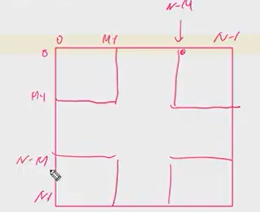

## 특별한 정렬


범위의 처음 위치가 우리가 swap해서 최솟값을 위치시킬 위치이다.


```python
# 선택 정렬
arr = [64, 25, 10, 22, 11]
N = len(arr)

for i in range(0, N-2+1):

    # (0, N-1) 최소값 찾기
    idx = i       # 시작 위치를 최소값 가정
    for j in range(i+1, N):
        if arr[idx] > arr[j]:
            idx = j
    arr[i], arr[idx] = arr[idx], arr[i]

    print(arr)


```


## 색칠하기

```python
arr = [[0]*10 for _ in range(10)]

# 좌상단, 우하단 좌표
x1 = y1 = 3    # (3, 3)
x2 = y2 = 7    # (7, 7)

for i in range(x1, x2 + 1):
    for j in range(y1, y2 + 1):
        arr[i][j] = 1
for lst in arr:
    print(*lst)                # @@@@   *붙이면 [] 없어짐 (unpacking)
```

```python
arr = [[0]*10 for _ in range(10)]

x, y = 3, 4
size = 3

for i in range(x, x + size):
    for j in range(y, y + size):
        arr[i][j] = 1
        
for lst in arr:
    print(*lst)                # @@@@   *붙이면 [] 없어짐
```


#### Unpacking 하는 법

```python
for lst in arr:
    print(*lst)                # @@@@   *붙이면 [] 없어짐 (unpacking)
```


## 파리퇴치 (최대 or 최소를 찾아라 -> 최적화 문제)

### 다 해본다 -> 완전검색!!!!

### 좌상단과 size를 이용하여 처리할 수 있다.





-> 좌상단 좌표가 될 수 있는 범위는  0 ~ N-M


### 리스트 함축식

```python
arr = [1, 2, 3, 4, 5, 6, 7, 8, 9]
arr = [list(map(int, input().split())) for _ in range()]


arr = [x for x in range(1, 11)]


for i i n range(4):
    arr = list(map(int, input().split())) for _ in range()
    matrix.append(arr)
```


## 1~9까지 검사 하는법

#### 인덱스를 이용해서 숫자 출현 횟수 체크하기

#### 만약에 숫자가 1~9까지 주어진다면,

```python
10칸짜리를 만듦 [0] [1] [2] [3] [4] [5] [6] [7][8] [9]

[0]을 버려버리고 1~9까지의 인덱스에 해당되는 곳만 사용.


```


## 부분집합

4 bit --> 0~15

4bit로 표현 가능한 모든 경우 중에 1이 2번 포함된 경우

ex) 1100 1010 1001


```python
for bits in range(1<<4):
    cnt = 0
    for i in range(4):
        if bits & (1<<i):
            cnt += 1
    
    if cnt == 2:
        for i in range(3, -1, -1):
            if bits & (1<<i): print(1, end='')
            else: print(0, end = ''):
        print()
```

