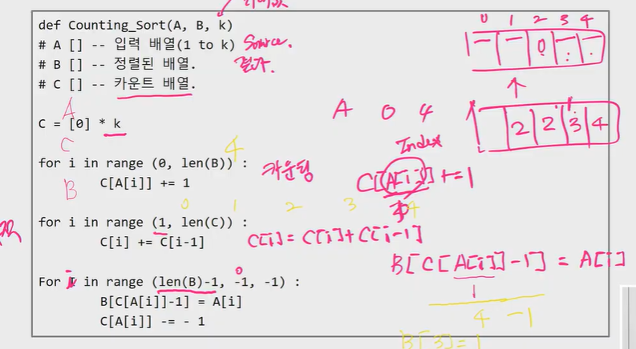
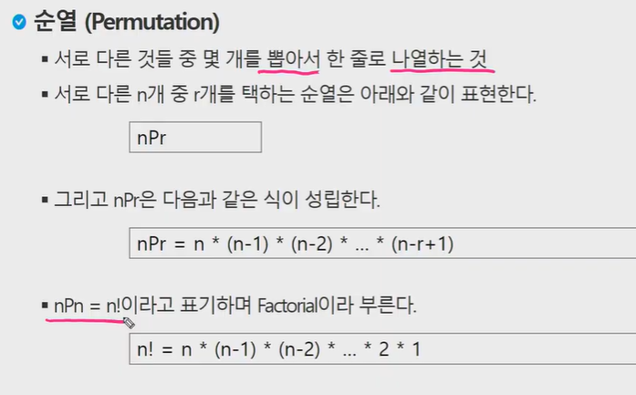

## 알고리즘

: 유한한 단계를 통해 문제를 해결하기 위한 절차


## 알고리즘을 표현 하는 방법 두 가지

1) 슈더코드

2) 순서도


## 좋은 알고리즘이란?

: 정확성 / 작업량 / 메모리 사용량 / 단순성 / 최적성


## 시간 복잡도 = 빅-오 표기법

* 빅-오 표기법

  : 시간 복잡도 함수 중에서 가장 큰 영향력을 주는 n에 대한 항만 표시

    계수는 생략하여 표시


## 배열이란?

: 일정한 자료형의 변수들을 하나의 이름으로 열거하여 사용하는 자료 구조


## 배열의 필요성

* 배열을 사용하면 하나의 선언을 통해서 둘 이상의 변수를 선언할 수 있다.
* 단순히 다수의 변수 선언을 의미하는 것이 아니라, 다수의 변수로는 하기 힘든 작업을 배열을 활용해 쉽게 할 수 있다.


|code|

|data| : 정적, 전역

|heap| : 참조형 변수

|stack| : 지역 변수


# 정열

: 2개 이상의 자료를 특정 기준에 의해 작은 것부터 큰 값 or 그 반대의 순서대로 재배열 하는 것.


## 대표적인 정렬 방식의 종류

* Bubble sort (n^2)
* Counting sort (n + k)
* Selection sort (n^2)
* Quick sort (n log(n))
* Insertion sort (n^2)
* Merge sort (n log(n))


## Bubble Sort

: 인접한 두개의 원소를 비교하며 자료를 계속 교환하는 방식


### 정렬 과정

* 첫 번째 원소부터 인접한 원소끼리 계속 자리를 교환하면서 맨 마지막 자리까지 이동.
* 한 단계가 끝나면 가장 큰 원소가 마지막 자리로 정렬.


### 시간 복잡도 : O(n^2)


```python
def BubbleSort(a):        # 정렬할 list
    for i in range(len(a)-1, 0, -1):
        for j in range(0, i):
            if a[j] > a[j+1]:
                a[j], a[j+1] = a[j+1], a[j]    # 스왑
```


## 카운팅 정렬 (Counting Sort)

: 항목들의 순서를 결정하기 위해 집합에 각 항목이 몇개씩 있는지 세는 작업을 하여, 선형 시간에 정렬하는 효율적인 알고리즘.    # 문자, 문자열 X

**원본은 그대로 있고 결과물이 따로 나옴**


### 1단계

: Data에서 각 항목들의 발생 회수를 세고, 정수 항목들로 직접 인덱스 되는 카운트 배열 counts에 저장한다.


: 정렬된 집합에서 각 항목의 앞에 위치할 항목의 개수를 반영하기 위해 counts의 원소를 조정한다.


## 카운팅 정렬 알고리즘

```python
def Counting_Sort(A ,B, k)         # K는 최댓값

# A []  ------ 입력배열
# B []  ------ 정렬된 배열
# C []  ------ 카운트 배열

C = [0] * k  # k 갯수만큼 초기화

for i in range(0, len(B)):
    C
```





## 완전 검색 (Exacutive Search)

: 완전 검색 방법은 문제의 해법으로 생각할 수 있는 모든 경우의 수를 나열해보고 확인하는 기법.

  모든 경우의 수를 생성하고 테스트하므로 느리지만 해답률 높음.

 `우선 완전 검색으로 접근하여 해답을 도출한 후, 성능 개선을 위해 다른 알고리즘을 사용하고 해답을 확인하는 것이 바람직하다.`





```python
for i1 in range(1, 4):
    for i2 in range(1, 4):
        if i1 != i2:
            for i3 in range(1, 4):
                if i3 != i1 and i3 != i2:
                    print(i1, i2, i3)
```


## 탐욕(Greedy) 알고리즘

: 최적해를 구하는데 사용되는 근시안적인 방법.

  여러 경우 중 하나를 결정해야 할 때마다 그 순간에 최적이라고 생각되는 것을 선택해 나감.

  각 선택의 시점에서 이루어지는 결정은 지역적으로는 최적이지만, 그 선택들을 모아 최종적인 해답   을 만들었다고 해서, 그것이 최적이라는 보장은 없다.


```python
# BabyGin을 greedy로 해결.


num = 456789
c = [0] * 12

for i in range(6):
    c[num % 10] += 1
    num //= 10          # num = num // 10

i = 0
tri = run = 0
while i < 10:
    if c[i] >= 3:
        c[i] -= 3
        tri += 1
        continue

    if c[i] >= 1 and c[i+1] >= 1 and c[i+2] >= 1:
        c[i] -=1
        c[i+1] -= 1
        c[i+2] -= 1
        run += 1
        continue

    i += 1

if tri + run == 2 : print("Baby Gin")
else: print('lose')
```


problem -> solving club 

learn -> 별도 제출 (드롭박스 링크) > 한번 제출하면 확인 못함 > 수정하고 싶으면 여러번 제출 


