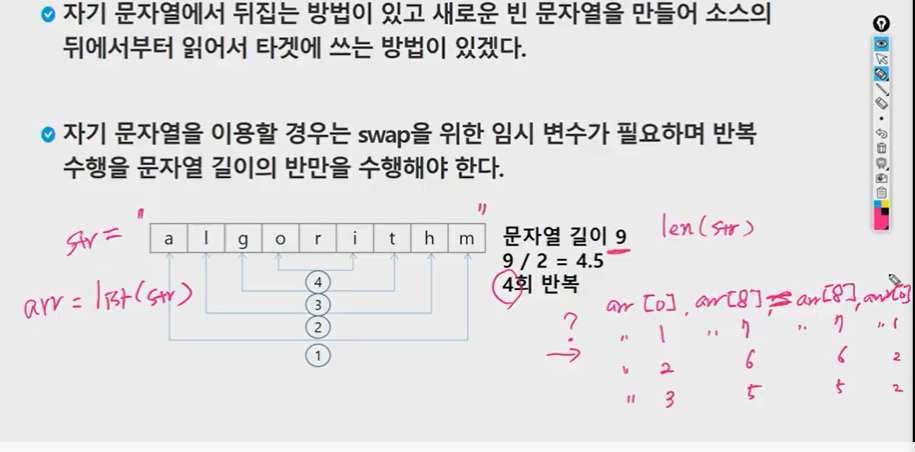
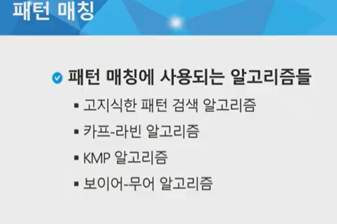
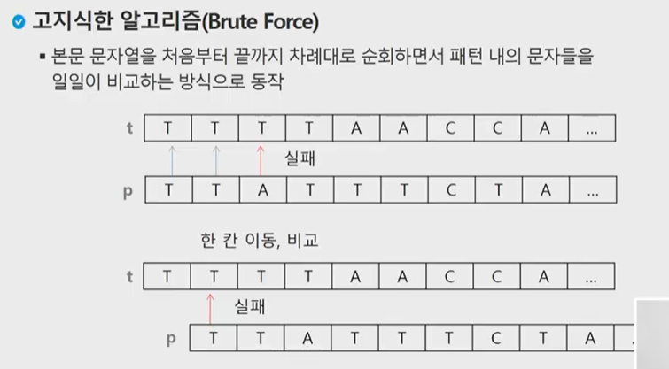
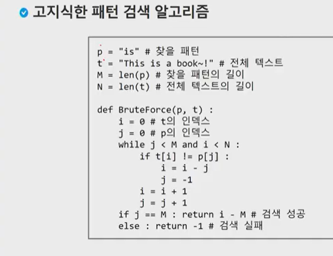
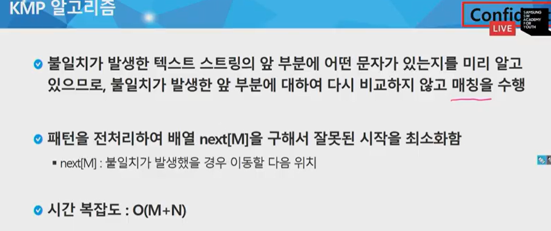
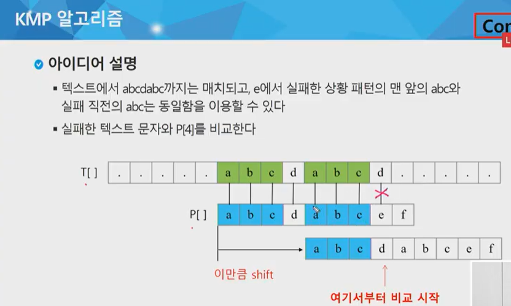
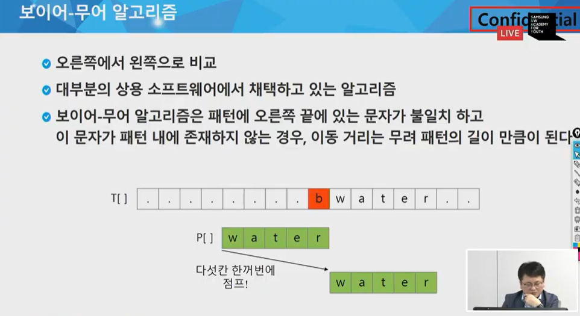
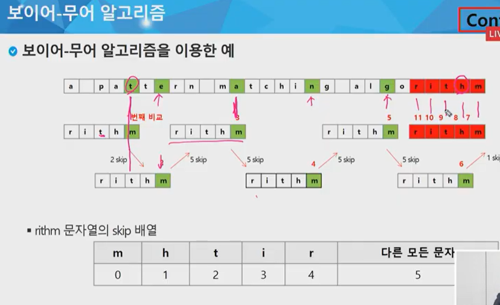
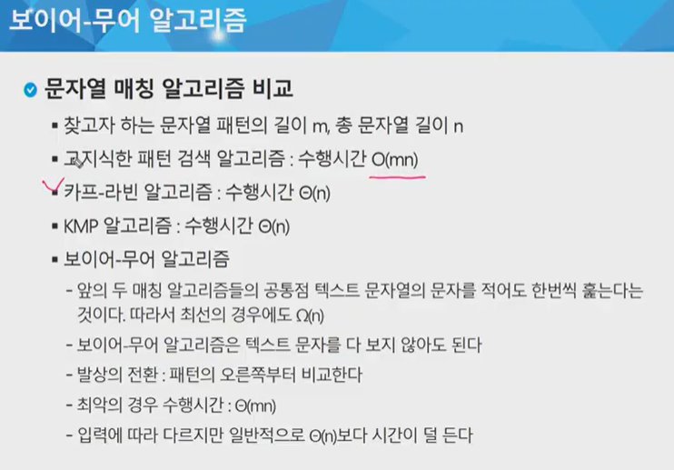

문자열은 튜플과 같이 요소값을 변경할 수 없다.





파이썬은 immutable이므로 list로 바꾼 뒤, `str = "".join(arr)`을 사용해서 list를 문자로 바꿔준다.


str -> list  - > swap    -> list -> str


```python
def str_rev(str):
	# str -> list
    arr = list(str)
    
    # swap
    for i in range(len(arr)//2):
        arr[i], arr[len(arr)-1-i] = arr[len(arr)-1-i], arr[i]
        
    # list -> str
    str = "".join(arr)
    

# -------------------
str = "algorithm"
str1 = str_rev(str)
print(str1)
```

```python
str = "algorithm"
str1 = []
for i in range(1, len(str)-1):
    str1.append(str[-i])
    
or

for i in range(len(str)-1,-1,-1):
    str1.append(str[i])
    
str_rev = "".join(str1)
print(str_rev)
```

```python
# @@@@@@@@ 이거쓰기 @@@@@@@@
str = "algorithm"
b= a[::-1]
print("b: {}".format(b))
            
      or  
      
      
c = reversed(a)  # reversed()는 튜플, list 함수 / object 형태로 나오므로 list씌워줌
arr = list(c)
str2 = "".join(arr)
print(str2)
```


## strcmp (문자열 비교)

```python
def strcmp(s1, s2):
    i = 0
    if len(s1) != len(s2):
        return False
    else:
        i = 0 
        while i < len(s1) and i < len(s2):
            if s1[i] != s2[i]:
                return False
            i += 1
	return True
            
a = "abc"
b = "abc"

print(strcmp(a, b))        # True, False
```

But 평소에는 그냥 == 사용하기.


```python
# atoi 함수 만들기: 숫자형태의 문자열을 바아서 숫자로 변경
# atoi('123') >> 123
# ['1', '2', '3']
# '1' >> 1      0*10 + 1 >> 1
# '2' >> 2  / 둘을 합치려면 1*10 + 2 >> 12 만들 수 있음
# '3' >> 3, 	12*10 + 3 >> 123
# '4' >> 4      123*10 + 4 >> 1234

def atoi(str):
    value = 0
    is_negative = False
    for i in range(len(str)):
        if i == 0 and str[i]=='-':
            is_negative = True
            continue
        c = str[i]
        # 0~9
        # str[i] 문자형태의 데이터를 숫자로 변경
        # str[i] >> '1' >> 아스키코드의 숫자를 이용해서 숫자로 변환
        #'1'd이라는 문자의 아스키 코드는 10진수 49
        # '0'은 48. 그래서 49-48=1 로써 1을 나타낼 수 있다.
        # ord('1'): '1'이라는 문자의 아스키 코드를 반환.
        
        if c >= '0' and c<="9":
            
            or
            
        if '0' <= c <= '9':
            digit = ord(c) - ord('0')
        else:
            break
        value = value * 10 + digit
        
    if is_negative:
        value = -value
    return value

a = [1, 2, 3]
b = atoi(a)
```


## 문자열 교환하기 atoi (replace사용)

```python
str1 = "abc 1, 2 ABC"

str1 = str1.replace("1, 2", "one, two")
print(str1)
```


## itoa

```python
def itoa(num):
    x = num # 몫
    y = 0 # 나머지
    arr = []
    while x:
        y = x % 10
        x = x // 10
        arr.append(chr(y+ord('0')))
        
    arr.reverse()
    str = "".join(arr)
    return str
x = 123
str = itox(x)
```










## 고지식한 패턴 검색 예시)

```python
def brute(t, p):
    i, j = 0, 0
    while j < len(p) and i < len(t):
        if t[i] != p[j]:
            i = i -j
            j = -1
        i += 1
        j += 1
    if j == len(p):
        return i -len(p)
    else:
        return -1

text - "TTTTTAACCA"
pattern = "TTA"

print(brute(text, pattern))
```

```python
#고지식한 패턴매칭
#주어진 문자열안에 특정 pattern이 존재하는지 여부를 출력하는
#프로그램 작성

str = "Hello world! Nice to meet you"                                 lll
pattern = "llo"

#target 안에서 pattern을 찾으면 True, 아니면 False 반환
# [][][][][][]  : 6
# [][][] : 3
# len(target) - len(pattern) + 1
def search(target,pattern):
    for i in range(len(target)-len(pattern) + 1):
        for j in range(len(pattern)):
            # 똑같으면 다음거 비교 진행,
            # 다르면 즉시 종료
            if pattern[j] != target[i+j]:
                break
     # 위 작은 반복문에서 break가 걸리면, 해당비교에서 patten을 못 찾은것.
    	else:    # for 반복문에서 break가 안걸리면,
            # 패턴 찾음
            return True
        # 위 작은 반복문에서 break가 걸리면,
        # 해당비교에서 pattern 못찾음
    return False

result = search(str, pattern)
print(result)
```













